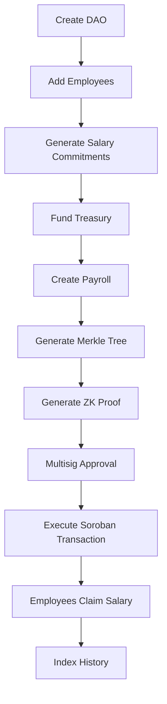
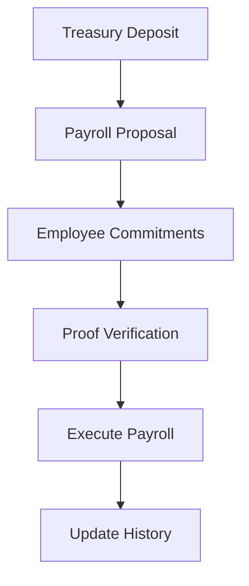
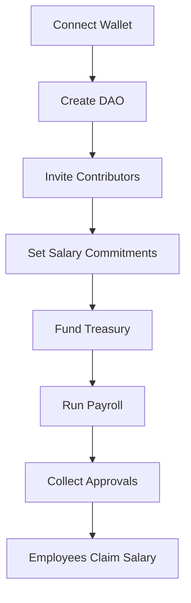

# TechTown-Private-DAO

## Confidential Contributor Payroll on Stellar

A fully open-source payroll platform where DAOs, startups, and open-source organizations can pay contributors using Stellar while keeping salary amounts confidential through Zero-Knowledge Proofs (ZKPs).

Instead of exposing every contributor's salary on-chain, the system proves that:

- Payroll follows company rules.
- Treasury has sufficient funds.
- Employees receive valid payments.
- No salary amount is publicly visible.

---

# Organization Structure

```text
TechTown-Private-DAO/
│
├── techtown-payroll-contracts/
├── techtown-payroll-backend/
├── techtown-payroll-web/
│
├── docs/
├── .github/
│   ├── ISSUE_TEMPLATE/
│   ├── workflows/
│   └── pull_request_template.md
│
├── LICENSE
├── CONTRIBUTING.md
├── ROADMAP.md
└── README.md
```

# Repository 1 – techtown-payroll-contracts

## Technology

- Rust
- Soroban SDK
- Stellar CLI
- Cargo
- OpenZeppelin Stellar libraries (when available)

```text
techtown-payroll-contracts/
├── src/
│   ├── dao.rs
│   ├── treasury.rs
│   ├── payroll.rs
│   ├── employee.rs
│   ├── zk_verifier.rs
│   ├── multisig.rs
│   ├── salary_commitment.rs
│   ├── errors.rs
│   ├── storage.rs
│   ├── events.rs
│   ├── types.rs
│   └── lib.rs
├── tests/
│   ├── integration/
│   └── unit/
├── scripts/
├── deploy.sh
├── invoke.sh
├── Cargo.toml
└── README.md
```

## Smart Contracts

### DAO Contract
Responsibilities:
- Organization creation
- Roles
- Governance
- Treasury permissions

Functions:
- create_dao()
- update_settings()
- add_admin()
- remove_admin()
- set_multisig()
- pause()
- unpause()

### Treasury Contract

Stores USDC, XLM and salary reserves.

Functions:
- deposit()
- withdraw()
- lock_budget()
- release_budget()
- balance()

### Employee Contract

Stores employee ID, wallet, commitment hash, department, status and payment history.

Functions:
- add_employee()
- remove_employee()
- update_wallet()
- freeze_employee()
- activate_employee()

### Payroll Contract

Functions:
- create_payroll()
- approve_payroll()
- execute_payroll()
- cancel_payroll()
- employee_claim()
- get_payroll()
- history()

### Salary Commitment

Instead of storing salary values directly, store:

```text
hash(salary, randomness)
```

Only the employee knows the salary and randomness.

### ZK Verifier

Verifies:
- Salary range
- Treasury balance
- Commitment validity
- No double payment
- Payroll approval

### Multisig

Supports approval thresholds such as:
- 3/5
- 5/7

# Repository 2 – techtown-payroll-backend

## Stack

- Rust
- Axum
- PostgreSQL
- Redis
- Stellar SDK
- Soroban SDK
- Docker
- BullMQ (optional)
- GraphQL

Responsibilities include payroll engine, scheduler, relayer, proof generation, notification service, REST API, database layer and background workers.

# Repository 3 – techtown-payroll-web

## Stack

- Next.js
- React
- TypeScript
- Tailwind CSS
- shadcn/ui
- Stellar Wallet Kit
- React Query
- Framer Motion

Pages:
- Landing
- DAO Dashboard
- Employee Dashboard
- Payroll Wizard
- Governance

# Backend Workflow



# Smart Contract Workflow



# Frontend Workflow



# GitHub Labels

- good first issue
- help wanted
- backend
- frontend
- contracts
- documentation
- security
- performance
- bug
- enhancement
- zk
- stellar
- dao
- payroll

# Milestones

## v0.1 Foundation
- DAO creation
- Treasury
- Wallet connection
- UI

## v0.2 Payroll Core
- Employee registry
- Payroll execution
- Transfers
- History

## v0.3 Confidential Payroll
- Commitments
- Merkle Tree
- ZK Proofs
- Verifier

## v0.4 Governance
- Multisig
- Proposals
- Budget
- Scheduling

## v1.0 Production
- Audit
- Documentation
- SDK
- API
- Deployment
- Contributor onboarding

# CI/CD

Each repository includes:
- Linting
- Formatting
- Unit tests
- Integration tests
- Soroban contract compilation
- Backend API tests
- Frontend build
- End-to-end tests
- Docker image publishing
- Release automation

# Open Source Roadmap

## Contracts
- DAO registry
- Treasury
- Employee registry
- Payroll
- Salary commitments
- Merkle verification
- ZK verifier
- Multisig
- Event indexing
- Upgradeability

## Backend
- REST API
- Scheduler
- Relayer
- Proof service
- Monitoring
- Notifications
- Audit logs
- GraphQL
- Indexer
- Docker

## Frontend
- Landing page
- DAO dashboard
- Employee management
- Payroll wizard
- Treasury analytics
- Governance UI
- Wallet integration
- Salary claims
- Activity feed
- Mobile support
